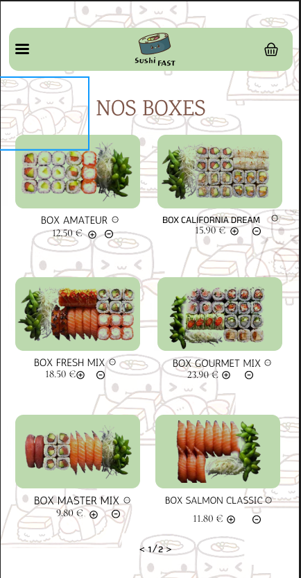
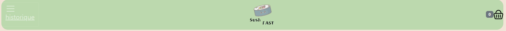
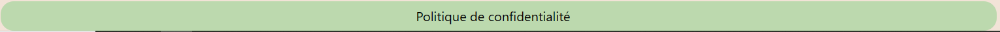
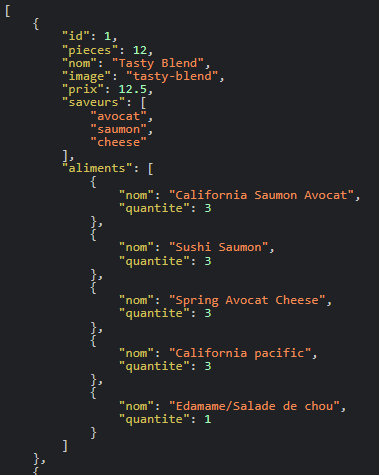
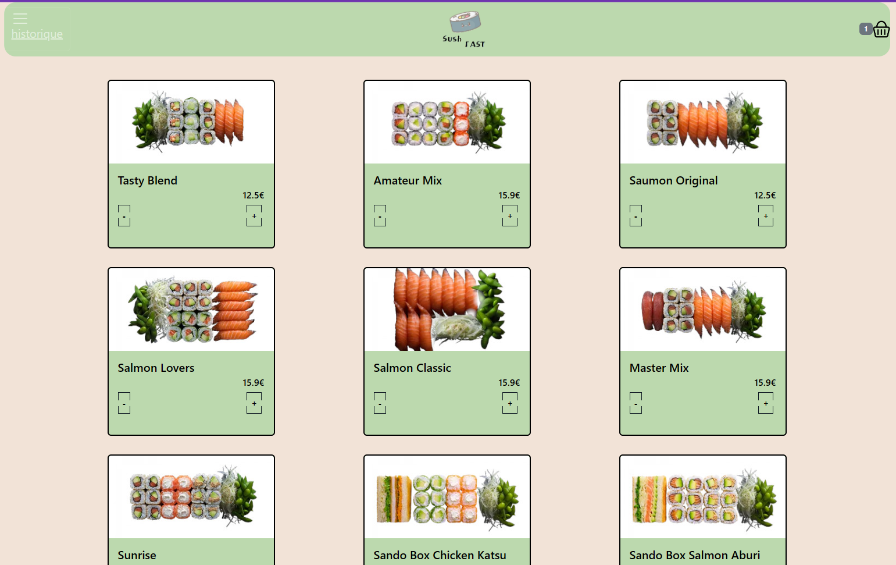
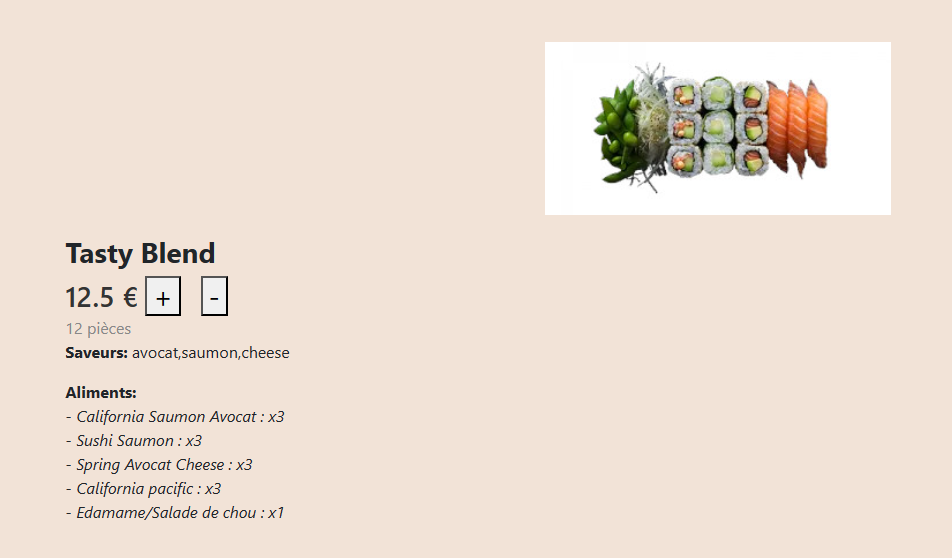
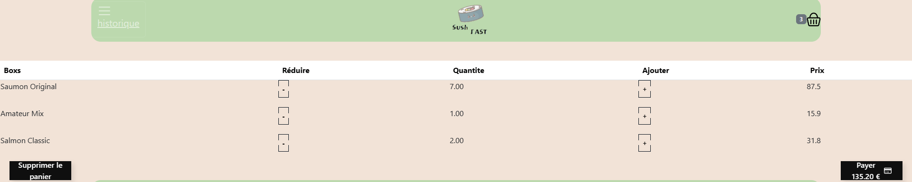
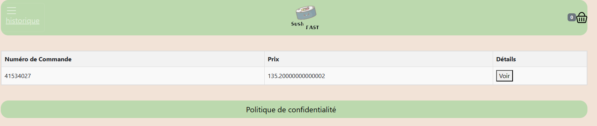

= Table of Contents

== Contexte
== Introduction
== Maquette
== Header et Footer
== Affichage des boxes
== Details
== Panier
== Réalisé par :

Nassim Belkacem

Date début : Mars 2024

== Contexte
Qui dit 2nd semestre dit 2nd projet, cette fois c'était la création d'une application web de ventes de boxs de sushi. Les données des boxs étant récupérés via une API, on met en place un système de panier, affichage des boxs des prix, d'un RPGD et d'un historique.

== Introduction
Pour démarrer le projet, j’ai commencé par faire les maquettes de mon site avec Menu, détail, panier, historique et confirmation de la commande.

== Maquette

La maquette à était réalisé en collaboration avec Sheinez, je n'ai fais que de m'inspirer de ce qu'elle à fait pour la réalisation de mon site à moi.

== Header et Footer

J'ai réalisé le header et le footer pour Sheinez et moi, ce n'était pas très compliqué, si ce n'est qu'elle devait trouver un moyen pour que le logo soit en format png, mais lors de la conversion de l'image des caractères se faisaient "manger"

image::logo.png[]

Le code du Header
[source,HTML]
----

    <nav class="navbar navbar-dark" style="background-color: #BCD9AE; border-radius: 20px; width: 80%;">
      <a href="/historique" class="navbar-toggler" type="button" aria-label="Toggle navigation">
         
historique

     </a>
      <a class="navbar-brand mx-auto" href="#">
         <!-- Utilisation du chemin fourni -->
      </a>
      

        <a href="panier">
          {{nombreTotalBoxs()}}
          
        </a>
      

    </nav>
  

----

Ensuite le footer qui contient uniquement la page concernent la politique de confidentialité:

[source,HTML]
----
<footer class="pos-f-t d-flex justify-content-center" style="margin-top: 40px;">
    <nav class="navbar navbar-dark" style="background-color: #BCD9AE; border-radius: 20px; width: 80%;">
        

            <a class="navbar-brand text-black"  href="/rgpd">Politique de confidentialité</a>
        

    </nav>
</footer>
----

== Affichage des boxes

Pour l'affichage des boxs, il faut s'assurer d'avoir l'API de lancer en local sur sa machine, une fois que c'est fait on vérifie bien qu'on récupérer les données au format JSON sur notre navigateur via ce lien :

Ensuite on récupére les boxs grâce au lien de l'API dans le service "boxs.service.ts"

[source,typescript]
----
  public getBoxs(): Observable<any>{
    console.log(this.http.get(environment.apiBaseUrl))
    return this.http.get(environment.apiBaseUrl)
  }
----

Puis on crée la classe qui va construire nos objets Boxs dans le modele : Box.ts
[source,typescript]
----
export class Box{

  public id:number
  public pieces: number
  public nom:string
  public image:string
  public prix: number
  public saveurs: Array<string>
  public aliments: Array<any>

  constructor(id:number,pieces:number,nom:string,image:string,prix:number,saveurs:Array<string>,aliments:Array<any>){
      this.id=id
      this.pieces=pieces
      this.nom=nom
      this.image = image
      this.prix = prix
      this.saveurs = saveurs
      this.aliments = aliments
  }

static transforme(unObjet: any){

  return new Box(unObjet.id,unObjet.pieces,unObjet.nom,unObjet.image,unObjet.prix,unObjet.saveurs,unObjet.aliments)
}
static transformeArray(unTab:Array<any>):Array<Box>{
  let resultat :Array<Box>=[]
  for (const unObjet of unTab){
      let uneBox= this.transforme(unObjet)
      resultat.push(uneBox)
  }
  return unTab
}
}
----

Une fois la classe créée, on récupére les boxs depuis l'API et on assigne les données à nos objets boxs grâce à la méthode, les données seront transformées en objets manipulables par le navigateur (on ne peut pas manipuler des données json directement):
[source,typescript]
----
  constructor(private boxs: BoxsService, private panierManager:PanierManagerService) {
    this.boxs.getBoxs().subscribe((resultat) => {
      console.log(resultat)

      for (const uneBox of resultat) {
        let box1 = Box.transforme(uneBox)
        this.boxes.push(box1)
      }
    })
  }
----

Maintenant on les affiche:

[source,HTML]
----

<!-- Container principal -->

    <!-- Grille de cartes -->
    

        <!-- Boucle sur les boîtes de sushis -->
        

            <!-- Carte de boîte de sushi -->
            

                <!-- Image de la boîte -->
                
                

                    <!-- Détails de la boîte -->
                    <h5 class="card-title" style="color: black;">{{box.nom}}</h5>
                    <h6 class="card-subtitle mb-2" style="text-align: right; color: black">{{box.prix}}€</h6>
                    <!-- Boutons +/- -->
                    <button class="button" (click)="reduireQuantite(box)">-</button>
                     <!-- Espace entre les boutons -->
                    <button class="button" (click)="ajoutLigne(box)">+</button>
                

            

        

    

----

Résultat final de nos boxs:

== Details

En ce qui concernent les détails des boxs et leur affichage, il suffit de cliquer sur les images dans la page d'accueil, et hop:

Pour faire ça, il faut récupérer les données et les transformer encore une fois, il faudra juste récupérer l'id de la box à afficher dans l'url en plus (fichier: detail-box.component.ts):

[source,typescript]
----
  ngOnInit(): void {
    this.route.params.subscribe(params =>{
      this.idBox=params['id'];
    });
    this.boxsService.getBoxs().subscribe((res:any)=> {
      this.listBoxes = res
      this.getData()
    })
  }
----

Ensuite on affiche
[source, html]
----

    

        

            
        

        

            

                <h3><b>{{boxData.nom}}</b></h3>
            

            

                <h3>{{boxData.prix}} € <button class="plus">+</button><button style="margin:0 20px;"class="moins">-</button></h3>
            

            

                
{{boxData.pieces}} pièces

            

            

                
<b>Saveurs:</b> {{boxData.saveurs}} 

            

            

                
<b>Aliments:</b>  <i *ngFor="let aliment of boxData.aliments">- {{aliment.nom}} :
                        x{{aliment.quantite}}  </i>

            

        

    

----

== Panier

Pour le panier on a plein de méthodes différentes:

[source, typescript]
----
export class PanierComponent {
  monPanier: Array<Ligne>; // Déclaration de la variable pour stocker les éléments du panier

  constructor(private panierManager: PanierManagerService) {
    // Constructeur de la classe, initialise le panier en récupérant les données du service PanierManagerService
    this.monPanier = this.panierManager.getAllBoxes(); // Initialise monPanier avec les éléments récupérés du service
  }

  ajoutLigne(box: Box) {
    // Méthode pour ajouter une ligne au panier
    return this.panierManager.addPanier(box, 1); // Appelle la méthode addPanier du service pour ajouter la boîte spécifiée avec une quantité de 1
  }

  total() {
    // Méthode pour calculer le total du panier
    return this.panierManager.totalPanier(); // Appelle la méthode totalPanier du service pour obtenir le total du panier
  }

  reduireQuantite(box: Box) {
    // Méthode pour réduire la quantité d'une boîte dans le panier
    return this.panierManager.minusPanier(box, 1); // Appelle la méthode minusPanier du service pour réduire la quantité de la boîte spécifiée de 1
  }

  clearPanier() {
    // Méthode pour vider le panier
    this.panierManager.clearPanier(); // Appelle la méthode clearPanier du service pour vider le panier
    this.monPanier = []; // Réinitialise monPanier à un tableau vide
  }

  ajouterhistorique() {
    // Méthode pour ajouter le contenu actuel du panier à l'historique et réinitialiser le panier
    this.panierManager.ajouterHistorique(this.monPanier); // Appelle la méthode ajouterHistorique du service pour ajouter le contenu actuel du panier à l'historique
    localStorage.setItem("panier", "[]"); // Réinitialise le panier dans le stockage local en le définissant comme un tableau vide
    this.monPanier = []; // Réinitialise monPanier à un tableau vide
  }
}
----
Le panier ressemble à ça d'ailleurs:

Chaque méthode est commentée et explique ce qu'elle fait, elle sont déclarées dans le modèle du panier (panier-manager.service.ts). On va observer la méthode de l'historique comme ça on en aura fait le tour de toute l'application:

[source, typescript]
----
ajouterHistorique(panier: Array<Ligne>) {
  // Ajoute le contenu du panier à l'historique des commandes
  this.historiqueCommandes.push(panier); // Ajoute le panier spécifié à la liste des historiques des commandes

  // Met à jour l'historique des commandes dans le stockage local du navigateur
  localStorage.setItem('historique', JSON.stringify(this.historiqueCommandes)); // Convertit la liste des historiques des commandes en une chaîne JSON et la stocke dans le stockage local sous la clé 'historique'

  // Affiche l'historique des commandes dans la console à des fins de débogage
  console.log(this.historiqueCommandes); // Affiche l'historique des commandes dans la console du navigateur pour le débogage ou le suivi
}
----
On gère l'affichage du Panier en appelant les méthodes nécessaires sur les boutons par exemple le bouton "Supprimer le panier" appelera la méthode "clearPanier" déclarée dans le modèle et appelée par le component (panier-manager.service.ts)

[source, HTML]
----
<table *ngIf="monPanier" class="table">
  <thead>
      <tr>
          <th style="text-align: left;" scope="col">Boxs</th>
          <th scope="col">Réduire </th>
          <th scope="col">Quantite</th>
          <th scope="col">Ajouter</th>
          <th scope="col">Prix</th>
      </tr>
  </thead>
    <tbody *ngFor="let ligne of monPanier">
        <td >{{ligne.box.nom}}</td>
        <button class="button" (click)="reduireQuantite(ligne.box)">-</button>
        <td>{{ligne.qte| number: '1.2-2'}}</td>
        <button class="button" (click)="ajoutLigne(ligne.box)">+</button>
        <td>{{ligne.box.prix * ligne.qte}}</td>
    </tbody>

    <button style="margin-right:10 px;" class="Btn-supp" (click)="clearPanier()">Supprimer le panier</button>
    <button class="Btn-pay" (click)="ajouterhistorique(); clearPanier();">
      Payer  {{total() | number:'1.2-2'}} €
      <svg class="svgIcon" viewBox="0 0 576 512"><path d="M512 80c8.8 0 16 7.2 16 16v32H48V96c0-8.8 7.2-16 16-16H512zm16 144V416c0 8.8-7.2 16-16 16H64c-8.8 0-16-7.2-16-16V224H528zM64 32C28.7 32 0 60.7 0 96V416c0 35.3 28.7 64 64 64H512c35.3 0 64-28.7 64-64V96c0-35.3-28.7-64-64-64H64zm56 304c-13.3 0-24 10.7-24 24s10.7 24 24 24h48c13.3 0 24-10.7 24-24s-10.7-24-24-24H120zm128 0c-13.3 0-24 10.7-24 24s10.7 24 24 24H360c13.3 0 24-10.7 24-24s-10.7-24-24-24H248z"></path></svg>
    </button>
  </table>
----

La méthode "ajouterHistorique" utilisait par le panier permet d'ajouter une ligne de commande dans l'historique. Quant à l'historique en lui même, c'est le même principe que l'affichage du panier. Des méthodes spécifiques au fonctionnement de l'historique sont déclarées, cette fois-ci, directement dans le component, comme ceci:

[source, typescript]
----
export class HistoriqueComponent {
  historiqueCommandes: any

  constructor(private panierManager: PanierManagerService) { }

  ngOnInit(): void {

    this.historiqueCommandes = this.panierManager.getHistorique()
  }
  PrixTotalCommande(commande: Array<Ligne>): number {
    let prixTotal = 0;
    for (let item of commande) {
      prixTotal += item.box.prix * item.qte;
    }
    return prixTotal;
  }
  NumCommande(){
    return this.panierManager.getNumCom()
  }
  afficherDetails(commande: any) {
    alert('détails de la commande:')
  }
}
----

Ainsi on obtiendra un historique ressemblant à cela:

